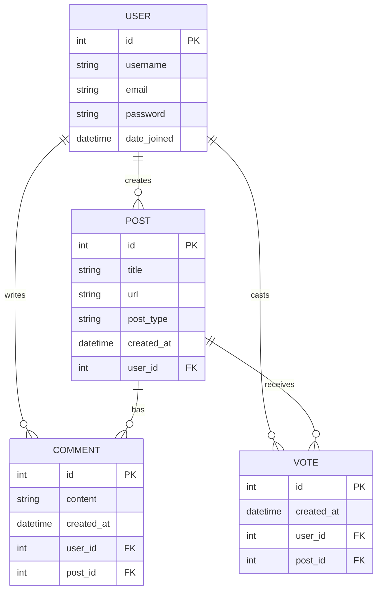

# Entity Relationship Diagram (ERD)

## Overview

This ER Diagram represents the database design for the Hacker News Clone project. It models users, posts, comments, and votes. Users can create news posts, Ask posts, comment on discussions, and upvote content.

## Relationship Summary

* One User can create many Posts.
* One User can write many Comments.
* One User can cast many Votes.
* One Post can have many Comments.
* One Post can receive many Votes.

## Notes

* NEWS posts contain a title and URL.
* ASK posts contain a title and discussion question.
* Users can upvote posts.
* Users can comment on posts.
* Each vote belongs to one user and one post.
* Each comment belongs to one user and one post.
