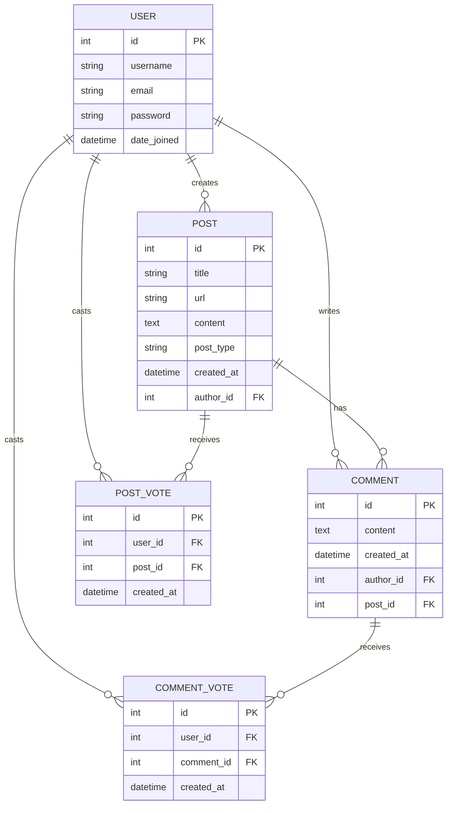

# Entity Relationship Diagram (ERD)

## Mermaid ER Diagram



## Relationships

### User → Post

One user can create many posts.

### User → Comment

One user can write many comments.

### User → Post Vote

One user can vote on many posts.

### User → Comment Vote

One user can vote on many comments.

### Post → Comment

One post can have many comments.

### Post → Post Vote

One post can receive many upvotes.

### Comment → Comment Vote

One comment can receive many upvotes.

---

## Example

### Pieter Levels

Creates:

```text
Show HN: Nomad List
```

### Santu

* Upvotes the post
* Comments on the post

### Dan Abramov

* Upvotes Santu's comment

```text
Pieter ----creates----> Post

Santu ----upvotes----> Post
Santu ----writes-----> Comment

Dan ------upvotes----> Comment
```

---

## Why Comment Votes?

Comment votes help:

* Surface useful discussions
* Highlight high-quality answers
* Reduce visibility of low-quality comments
* Improve community engagement

This matches the behavior of the real Hacker News platform where both posts and comments can receive points.
